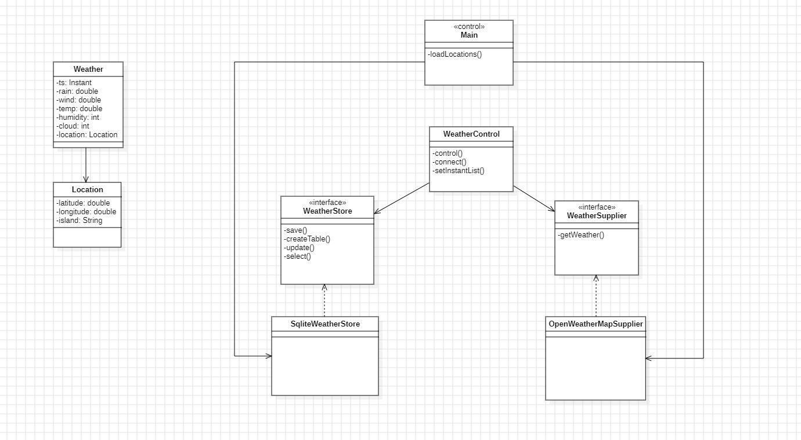

# WeatherApp

## Subject: DACD
### Curse: 2º

#### Degree: Data Science and Engineering 
#### School: Computer School
#### University: ULPGC

---

# Summary of the application:
### The aim of this application is to periodically collect weather information from the 8 Canary Islands using an API called Open Weather Map, and once the application has that information, it is stored in a SQLite database that has a table for each island.

---
# How to use
### Find the apikey variable and assign your OpenWeatherMap API key in the Main.java class and run it.

---

# Resources used
### This application has been developed in the IntelIJ environment, using Git as the version control system. Maven has also been used as a build and dependency management Tool.

---

# Structure of the project
## Main.java:
- ### Entry point of the application.
- ### Loads the locations and starts a timer to periodically update the weather data.

## OpenWeatherMapSupplier.java:
- ### Implements the WeatherSupplier interface.
- ### Gets weather data from the OpenWeatherMap API.

## SqliteWeatherStore.java:
- ### Implements the WeatherStore interface.
- ### The necessary statements are created to work with the SQLite database.

## WeatherControl.java:
- ### Controls the main logic of the application.
- ### Gets weather data, creates and updates the database and manages the connection to the database.

## WeatherStore.java:
- ### Defines the interface for storing and retrieving weather data.

## WeatherSupplier.java:
- ### Defines the interface for obtaining weather data.

## Location.java:
- ### Model to represent a geographic location.

## Weather.java:
- ### Model to represent weather data.
--- 

# Principles of design
## Single Responsibility Principle (SRP):
- ### Classes have unique and well-defined responsibilities. For example, WeatherControl handles control logic, OpenWeatherMapSupplier fetches data, and SqliteWeatherStore handles database storage.
## Dependency Inversion Principle (DIP):
- ### Classes depend on abstractions (interfaces) rather than concrete implementations. WeatherControl depends on the WeatherSupplier and WeatherStore interfaces, allowing changes to implementations without affecting WeatherControl.
## Principle of Composition over Inheritance:
- ### Composition is favoured over inheritance. For example, instead of inheriting from Location in the Weather class, an instance of Location is composed within Weather.

---

# UML class diagram

--- 

# Dependencies
- ### Gson: Library for JSON data manipulation in Java.
- ### JDBC (Java Database Connectivity): Java standard library for interaction with databases.
